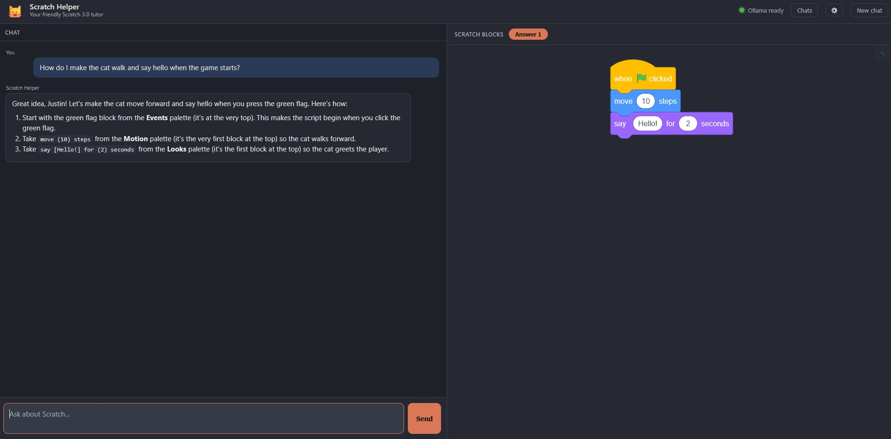
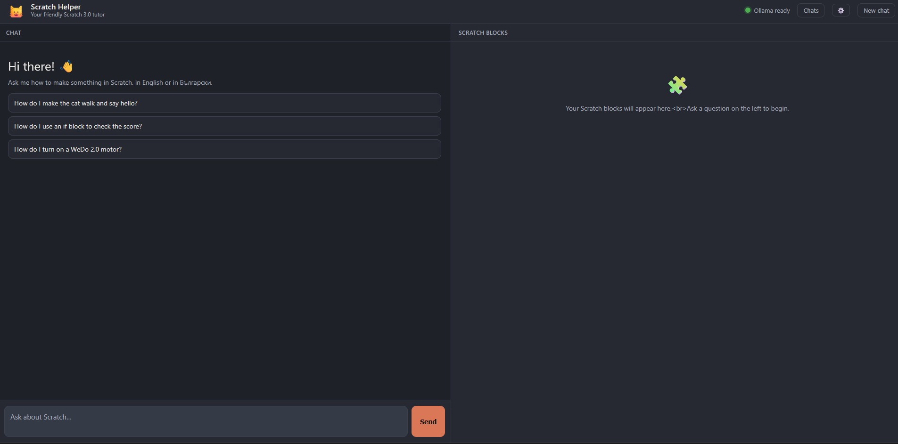

# Scratch Helper 🐱

A small, friendly local web helper that teaches **Scratch 3.0** (the offline
desktop editor) to a young child. You ask how to make something — in **English**
or **Български** — and a tutor model (any model served by **Ollama** — the
default is `glm-5.2:cloud`) explains the steps on the left and draws the actual
Scratch blocks on the right.

No accounts, no RAG. Chats **are saved locally** on your machine (a tiny SQLite
file) so you can come back to them — open the **“Твоите чатове” / “Your chats”**
drawer from the top bar. Deleting a chat or clearing the file removes them.



```
your browser  ──/api/chat──▶  this server (node, no deps)  ──▶  Ollama
   left pane: chat                right pane: scratchblocks SVG (EN + Български)
        │                              │
        │                              ├─ local Ollama app (http://localhost:11434)  ──▶  Ollama Cloud (":cloud" models)
        │                              └─ Ollama Cloud API (https://ollama.com + API key)
        │
        └─/api/chats──▶  scratch_helper.db (local SQLite: chat history + prefs)
```

The server talks to Ollama over the OpenAI-compatible `/v1/chat/completions`
endpoint, so **any Ollama-hosted model works** — a small local model, a
cloud-proxied model through the desktop app, or a cloud model via the Ollama
Cloud API. Set it with the `SCRATCH_MODEL` env var.

## Requirements

1. **Node.js 22.5+** (uses the built-in `node:sqlite` for chat history). — https://nodejs.org
2. **An Ollama backend** — pick one of the two modes below.

### Mode A — Local Ollama app (default)

Install and run the **Ollama desktop app**, and **sign in** to Ollama Cloud so
the `:cloud` models work:
- Start the Ollama app.
- Run `ollama signin` once in a terminal and follow the prompts.
- Confirm the model is available: `ollama list` should show your model (e.g.
  `glm-5.2:cloud`). Cloud-proxied models are served by Ollama Cloud — you do
  **not** download gigabytes locally. Run `ollama run <model>` once to register
  it if it isn't listed yet.
- The default address `http://localhost:11434` is used.

### Mode B — Ollama Cloud API (direct, no desktop app)

Point the server at `https://ollama.com` and give it an **API key** (create one
at https://ollama.com/settings):
```
OLLAMA_BASE=https://ollama.com
OLLAMA_API_KEY=<your key>
SCRATCH_MODEL=glm-5.2
```
**Important — no `:cloud` suffix in API mode.** When you go through the local
app, the `:cloud` suffix (e.g. `glm-5.2:cloud`) is the signal that tells the
local daemon to proxy the request to Ollama Cloud, and the daemon strips it
before forwarding. When you call the Cloud API directly, there is no proxy, so
you must use the **plain model name** (e.g. `glm-5.2`). The server prints a
warning at startup if it sees a `:cloud` suffix while pointed at `ollama.com`.

### Configuration (env vars)

| Variable | Default | Purpose |
|---|---|---|
| `SCRATCH_MODEL` | `glm-5.2:cloud` | Any Ollama model name. Use `:cloud` only in Mode A. |
| `OLLAMA_BASE` | `http://localhost:11434` | Ollama base URL. `https://ollama.com` for Mode B. |
| `OLLAMA_API_KEY` | _(none)_ | Required for Mode B; ignored by the local app in Mode A. |

The server picks `http` vs `https` from `OLLAMA_BASE`, so cloud (HTTPS) works
without any other change.

Instead of exporting env vars, you can put them in a **`.env`** file next to
`server.js` (it's gitignored, so API keys there won't be committed):
```
OLLAMA_BASE=https://ollama.com
OLLAMA_API_KEY=<your key>
SCRATCH_MODEL=glm-5.2
```
The server loads it at startup; vars already set in your shell take precedence
over the file.

## Run

### Windows
Double-click **`start.bat`**, or in a terminal:
```
node --no-warnings server.js
```
A browser opens at `http://127.0.0.1:8787`.

### Linux / macOS
```
./start.sh
```

If port 8787 is busy the server automatically tries 8788–8790 and prints the
address it used.

## How to use

- Type a question like *“How do I make the cat walk and say hello?”* or
  *“Как да накарам котката да подскача?”* and press **Enter**.
- The **left pane** is the chat — the tutor explains the goal and the steps,
  including **which Scratch palette** each block lives in (and where in that
  palette for younger children).
- The **right pane** shows the Scratch blocks, drawn the way they look in the
  editor, in the same language you asked in.
- A **🤔 Thinking…** indicator appears the moment you send, while the model is
  still reasoning (and while the server checks the topic is on-Scratch).
- **New chat** (top-right) starts a fresh conversation. **Chats** (top bar) opens
  the history drawer — every conversation is saved locally and can be reopened
  or deleted there.
- Click any **Answer 1 / Answer 2 / …** tab on the right to switch between the
  block sets the tutor produced. A small semi-transparent **↖** icon appears
  under the tabs on hover; clicking it scrolls the matching instruction message
  to the top of the left chat pane.

## Screenshots

### Main two-pane view


### Initial view with prompt suggestions


## What’s inside

```
server.js                  tiny proxy + static server + SQLite history (zero deps)
public/
  index.html               two-pane page + chats drawer + preferences modal
  app.js                   streaming chat + fenced-block parsing + rendering
  styles.css               dark, Claude-style two-pane look
  vendor/scratchblocks.min.js  the block renderer (vendored, MIT, v3.7.0)
  locales/bg.json          Bulgarian block names (so BG blocks render natively)
scratchblocks-prompts/
  system.md                the tutor system prompt (bilingual, with cheat-sheets)
start.bat / start.sh       launchers
img/                       screenshots for the README
scratch_helper.db          local SQLite chat history (created on first run)
preferences.json           child's language/age/name (created when you save prefs)
```

The server exposes a small JSON API: `/api/chat` (streaming tutor answer),
`/api/preferences`, `/api/health`, and `/api/chats` + `/api/chats/:id` +
`/api/chats/:id/messages` for local history.

## How the language works

- The model detects your question's language and **replies in that language**,
  and writes the Scratch blocks in that language too.
- `scratchblocks` (the renderer) parses and displays blocks in the language the
  markup is written in. The frontend always renders with `languages: ['bg',
  'en']`, so English block names and Bulgarian block names both work; each
  script displays in the language the model wrote it in.
- The Bulgarian block names come from the official scratchblocks Bulgarian
  locale, so they match what the child sees in the Scratch editor set to
  Bulgarian.

## Safety notes

- The server runs a **two-layer safety guard**:
  1. A classifier short-circuits non-Scratch / non-robotics questions with a
     warm, in-language refusal before the tutor ever sees them.
  2. The tutor system prompt is hardened to refuse anything else off-topic
     (other programming languages, homework, stories, personal advice, toys/robots
     not controllable from Scratch 3.0, jailbreak attempts, etc.).
- The only Scratch-controllable hardware allowed is the official Scratch 3.0
  extensions: **WeDo 2.0, Pen, Music, micro:bit, LEGO MINDSTORMS EV3, LEGO
  BOOST, Makey Makey, and Go Direct Force & Acceleration**.

## Troubleshooting

- **“Ollama not reachable”** — in Mode A, start the Ollama app; the status dot
  turns green when it's up. Run `ollama signin` if you haven't. In Mode B, the
  dot reflects whether `OLLAMA_API_KEY` is set.
- **401 / “Unauthorized”** — Mode B only: your `OLLAMA_API_KEY` is missing,
  wrong, or expired. Recreate it at https://ollama.com/settings.
- **`:cloud` model not found in API mode** — you set `SCRATCH_MODEL=glm-5.2:cloud`
  while `OLLAMA_BASE=https://ollama.com`. Drop the `:cloud` suffix
  (`SCRATCH_MODEL=glm-5.2`). The server warns about this at startup.
- **Model not listed (Mode A)** — `ollama list` should include your model. If the
  model was renamed, set `SCRATCH_MODEL` to the new name before starting.
- **CORS / 403** — not expected, because the browser talks only to this server
  (same-origin), which talks to Ollama server-to-server. If you changed
  `OLLAMA_BASE` to a remote host, make sure that host is reachable.
- **Blocks don’t draw** — the model occasionally writes a block name that isn't
  recognized; ask the question again. The renderer draws unknown blocks in grey.
- **Windows env gotchas** — after changing any Ollama env var (`OLLAMA_HOST`,
  `OLLAMA_ORIGINS`, …), quit and relaunch the Ollama tray app; old terminals
  keep the old environment.

## Privacy

The page, the proxy, and the chat history all live on your own machine. Chat
history and preferences are stored in `scratch_helper.db` / `preferences.json`
next to the server — never sent anywhere. Remove them anytime
(`rm -f preferences.json scratch_helper.db scratch_helper.db-*`), or delete
individual chats from the drawer.

The model traffic depends on your backend: with a **purely local model** (e.g.
a model you `ollama pull`ed) nothing leaves your machine; with a **`:cloud`
model** (either Mode A through the desktop app or Mode B through the API) the
conversation is sent to Ollama Cloud for inference.

## Assets

- **Logo / favicon (`img/logo.png`)**: generated with **Google Gemini** using the
  free tier (as of the March 2026 Gemini terms). Google does not claim ownership
  over generated content, and you may use generated content commercially in
  accordance with applicable law. Google may generate the same or similar content
  for others, may use free-tier prompts/responses to improve its products, and
  embeds an invisible SynthID watermark in generated images. See the
  [Gemini API Additional Terms of Service](https://ai.google.dev/gemini-api/terms).

## License

The included `scratchblocks.min.js` and `locales/bg.json` are MIT-licensed
(© scratchblocks contributors). The rest of this project is yours to use.
