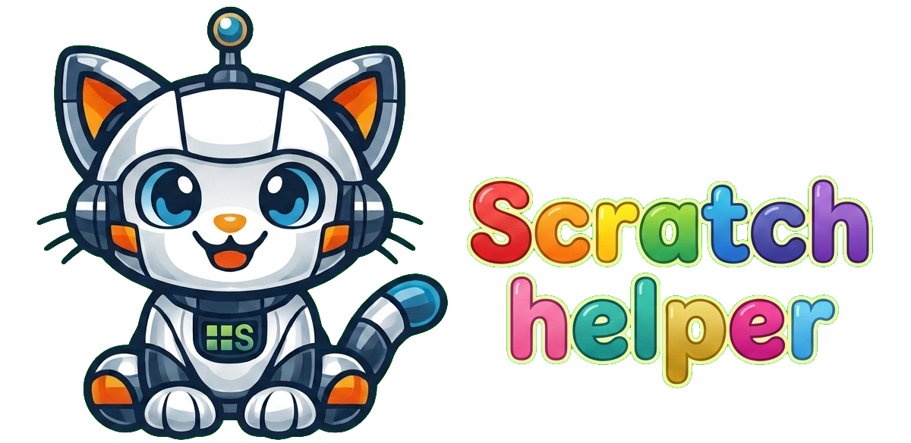

# Scratch Helper 🐱

<p align="center">
  
</p>

> **Personal, open-source, local-first.** This is a hobby project by a single
> developer, released under the **MIT License** (see
> [LICENSE](LICENSE) and the [Disclaimer](#disclaimer) below). It is a **local**
> web app intended to run on **your own machine** with **your own** Ollama
> backend — there is no hosted service and the author never sees your data. It
> is a **work in progress** and will keep evolving over time.

A small, friendly local web helper that teaches **Scratch 3.0** (the offline
desktop editor) to a young child. You ask how to make something — in **English**
or **Български** — and a tutor model (any model served by **Ollama** — the
default is `glm-5.2:cloud`) explains the steps on the left and draws the actual
Scratch blocks on the right.

No accounts, no RAG. Chats **are saved locally** on your machine (a tiny SQLite
file) so you can come back to them — open the **“Твоите чатове” / “Your chats”**
drawer from the top bar. Deleting a chat or clearing the file removes them.


```
your browser  ──/api/chat──▶  this server (node, no deps)  ──▶  Ollama
   left pane: chat                right pane: scratchblocks SVG (EN + Български)
        │                              │
        │                              ├─ local Ollama app (http://localhost:11434)  ──▶  Ollama Cloud (":cloud" models)
        │                              └─ Ollama Cloud API (https://ollama.com + API key)
        │
        └─/api/chats──▶  scratch_helper.db (local SQLite: chat history + prefs)
```

The server talks to Ollama over the OpenAI-compatible `/v1/chat/completions`
endpoint, so **any Ollama-hosted model works** — a small local model, a
cloud-proxied model through the desktop app, or a cloud model via the Ollama
Cloud API. Set it with the `SCRATCH_MODEL` env var.

## Requirements

1. **Node.js 22.5+** (uses the built-in `node:sqlite` for chat history). — https://nodejs.org
2. **An Ollama backend** — pick one of the two modes below.

### Mode A — Local Ollama app (default)

Install and run the **Ollama desktop app**, and **sign in** to Ollama Cloud so
the `:cloud` models work:
- Start the Ollama app.
- Run `ollama signin` once in a terminal and follow the prompts.
- Confirm the model is available: `ollama list` should show your model (e.g.
  `glm-5.2:cloud`). Cloud-proxied models are served by Ollama Cloud — you do
  **not** download gigabytes locally. Run `ollama run <model>` once to register
  it if it isn't listed yet.
- The default address `http://localhost:11434` is used.

### Mode B — Ollama Cloud API (direct, no desktop app)

Point the server at `https://ollama.com` and give it an **API key** (create one
at https://ollama.com/settings):
```
OLLAMA_BASE=https://ollama.com
OLLAMA_API_KEY=<your key>
SCRATCH_MODEL=glm-5.2
```
**Important — no `:cloud` suffix in API mode.** When you go through the local
app, the `:cloud` suffix (e.g. `glm-5.2:cloud`) is the signal that tells the
local daemon to proxy the request to Ollama Cloud, and the daemon strips it
before forwarding. When you call the Cloud API directly, there is no proxy, so
you must use the **plain model name** (e.g. `glm-5.2`). The server prints a
warning at startup if it sees a `:cloud` suffix while pointed at `ollama.com`.

### Configuration (env vars)

| Variable | Default | Purpose |
|---|---|---|
| `SCRATCH_MODEL` | `glm-5.2:cloud` | Any Ollama model name. Use `:cloud` only in Mode A. |
| `OLLAMA_BASE` | `http://localhost:11434` | Ollama base URL. `https://ollama.com` for Mode B. |
| `OLLAMA_API_KEY` | _(none)_ | Required for Mode B; ignored by the local app in Mode A. |

The server picks `http` vs `https` from `OLLAMA_BASE`, so cloud (HTTPS) works
without any other change.

Instead of exporting env vars, you can put them in a **`.env`** file next to
`server.js` (it's gitignored, so API keys there won't be committed):
```
OLLAMA_BASE=https://ollama.com
OLLAMA_API_KEY=<your key>
SCRATCH_MODEL=glm-5.2
```
The server loads it at startup; vars already set in your shell take precedence
over the file.

## Run

### Windows
Double-click **`start.bat`**, or in a terminal:
```
node --no-warnings server.js
```
A browser opens at `http://127.0.0.1:8787`.

### Linux / macOS
```
./start.sh
```

If port 8787 is busy the server automatically tries 8788–8790 and prints the
address it used.

## Testing

> **Full guide:** see [`TESTING.md`](TESTING.md) for setup, local + Docker +
> CI runs, the page objects, the SQLite factory, the Ollama mock helpers, and a
> step-by-step "write a new test" walkthrough.

Functional tests use **Playwright** (JavaScript). Playwright is a **dev-only**
dependency — the app itself stays zero-dependency, and normal users never need
`npm install`. Only developers/CI install it.

One-time setup for local no-Docker runs:
```
npm install
```

> `npm install` generates a `package-lock.json` locally, but it is
> **gitignored and not committed** — the app is zero-dependency, the only dev
> dep is pinned exactly in `package.json`, and CI/Docker regenerate the tree
> with `--no-package-lock`. Use `npm install` (not `npm ci`). See
> [`TESTING.md`](TESTING.md) for the full rationale.

### No-Docker local run
```
scripts/test.sh          # Linux / macOS
scripts\test.bat         # Windows
# or just:  npm test
```
Playwright's `webServer` (see `playwright.config.js`) starts the app itself on
`http://127.0.0.1:8787`, so you don't run `npm start` separately. The mocked
suite (`@mock`) intercepts `/api/chat` at the browser boundary, so **no real
Ollama call is made** and no API key is needed. The **OK / connected** health
state is **not** mocked — `initial.spec.js` verifies it against the real
`/api/health`; only the **error** states (Ollama down, model missing, fetch fail)
are mocked in `ollamaConnectionErrors.spec.js`, to check the UI reacts
accordingly (red/neutral dot, composer enabled vs disabled). The same spec also
covers a chat whose connection **drops mid-thinking**: health stays green (the
drop is on the chat path, not the health path) while the chat shows an error and
the composer is re-enabled for a retry. Run only the mock suite:
```
npm run test:mock
```
The real-API suite (`@real`) exercises the full server→Ollama path and needs a
real `OLLAMA_API_KEY` (and `SCRATCH_MODEL`) in your environment or `.env`:
```
npm run test:real
```

### Docker run (same as CI)
```
npm run test:docker
```
This brings up two containers via `docker-compose.yml`: the app (built from
`Dockerfile`) and the official Playwright container (`mcr.microsoft.com/playwright:v1.61.1`).
To run the real-API suite in Docker:
```
OLLAMA_API_KEY=<key> SCRATCH_MODEL=gpt-oss:20b PLAYWRIGHT_ARGS="--grep @real" npm run test:docker
```

### CI (GitHub Actions)
`.github/workflows/playwright.yml` runs on every PR and push to `main`:
- **Lint** — a single `lint` job that both test shards depend on: `node scripts/lint.js`
  does a `node --check` syntax pass over every project JS file (zero-dependency,
  no `npm install` needed). A syntax error fails the pipeline before either shard
  pays for a Docker build.
- **Mock functional tests** — always. Deterministic, no secret needed.
- **Real Ollama API tests** — only when the `OLLAMA_API_KEY` repo secret is set.
  `tests/real/safety.spec.js` exercises the safety gate: an off-topic question
  gets a refusal and no blocks.

Each run uploads the **Playwright HTML report** as a downloadable artifact and
posts a **pass/fail summary** to the workflow run page (via JUnit +
`dorny/test-reporter`).

### Test layout
```
playwright.config.js          webServer, reporters, projects (workers=1 — serial)
tests/
  pages/                      page objects (Base, Chat, BlocksPane, Preferences, ChatHistory)
  support/                    mockOllama (route interception + mockChatPartialThenHold), sqliteFactory, env, globalSetup (seeds DB once)
  utils/testConstants.js      shared seed chats + follow-up texts + 20-tab builder + off-topic prompt
  specs/initial.spec.js       @mock initial smoke test (first-run modal) + first-run-modal guard + age validation
  specs/newChatAndDeleteChat.spec.js  @mock new-chat + delete-chat + new-chat-mid-stream abort
  specs/gender.spec.js        @mock gender preference round-trip
  specs/followupBlocks.spec.js @mock follow-up -> 2nd block tab + ↖ jump-to-message; 20-tab arrow-scroll; tab-strip keyboard nav
  specs/splashLogo.spec.js    @mock splash logo matches saved language (no EN flash on BG refresh)
  specs/ollamaConnectionErrors.spec.js @mock /api/health error branches (down / model missing / fetch fail) -> UI reacts; OK state NOT mocked; + chat drops mid-thinking + chat HTTP-error (502)
  specs/stopButton.spec.js    @mock Stop aborts stream -> "(stopped)" + composer re-enabled; + Stop-with-partial-content
  specs/emptyAnswers.spec.js  @mock empty/no-blocks finalize paths (no content / reasoning-only / prose-no-fence)
  specs/persistence.spec.js   @mock answer persists across reload; rebuilt from DB
  specs/languageChange.spec.js @mock language switching via prefs (EN <-> BG, persists across reload)
  real/safety.spec.js         @real safety-gate test (off-topic -> refusal)
Dockerfile                    app image (zero-dep, non-root USER node)
docker-compose.yml            app + Playwright containers (shared DB volume)
.github/workflows/playwright.yml
scripts/test.sh / test.bat    no-Docker local run
scripts/lint.js               zero-dep lint (syntax + eval/loose-== warnings + no-deps invariant + git local-data guard; `npm run lint`)
```

Tests run **serially** (`workers: 1`): the suite shares one app instance, one
SQLite DB, and one `preferences.json`, so it is not parallel-safe at `workers>1`
(the first-run test deletes `preferences.json`; another test saving prefs
concurrently can recreate it before the first-run page reads it). See
[`TESTING.md`](TESTING.md) for the full rationale and how to lift that later.

The **SQLite factory** (`tests/support/sqliteFactory.js`) opens the same DB file
the app uses (`SCRATCH_DB_PATH`, shared via a Docker volume in CI) and can
`clear()` / `reset()` / `createNew()` and `insertChat` / `insertMessage` /
`insertConversation` for seeding scenarios.

## How to use

- Type a question like *“How do I make the cat walk and say hello?”* or
  *“Как да накарам котката да подскача?”* and press **Enter**.
- The **left pane** is the chat — the tutor explains the goal and the steps,
  including **which Scratch palette** each block lives in (and where in that
  palette for younger children).
- The **right pane** shows the Scratch blocks, drawn the way they look in the
  editor, in the same language you asked in.
- A **🤔 Thinking…** indicator appears the moment you send, while the model is
  still reasoning (and while the server checks the topic is on-Scratch).
- **New chat** (top-right) starts a fresh conversation. **Chats** (top bar) opens
  the history drawer — every conversation is saved locally and can be reopened
  or deleted there.
- Click any **Answer 1 / Answer 2 / …** tab on the right to switch between the
  block sets the tutor produced. A small semi-transparent **↖** icon appears
  under the tabs on hover; clicking it scrolls the matching instruction message
  to the top of the left chat pane.

## Screenshots

### Main two-pane view


### Initial view with prompt suggestions


## What’s inside

```
server.js                  tiny proxy + static server + SQLite history (zero deps)
public/
  index.html               two-pane page + chats drawer + preferences modal
  app.js                   streaming chat + fenced-block parsing + rendering
  styles.css               dark, Claude-style two-pane look
  vendor/scratchblocks.min.js  the block renderer (vendored, MIT, v3.7.0)
  locales/bg.json          Bulgarian block names (so BG blocks render natively)
scratchblocks-prompts/
  system.md                the tutor system prompt (bilingual, with cheat-sheets)
start.bat / start.sh       launchers
img/                       screenshots + logo_en / logo_bg (loading splash) for the README
scratch_helper.db          local SQLite chat history (created on first run)
preferences.json           child's language/age/name/gender (created when you save prefs)
```

The server exposes a small JSON API: `/api/chat` (streaming tutor answer),
`/api/preferences`, `/api/health`, and `/api/chats` + `/api/chats/:id` +
`/api/chats/:id/messages` for local history.

## How the language works

- The model detects your question's language and **replies in that language**,
  and writes the Scratch blocks in that language too.
- `scratchblocks` (the renderer) parses and displays blocks in the language the
  markup is written in. The frontend always renders with `languages: ['bg',
  'en']`, so English block names and Bulgarian block names both work; each
  script displays in the language the model wrote it in.
- The Bulgarian block names come from the official scratchblocks Bulgarian
  locale, so they match what the child sees in the Scratch editor set to
  Bulgarian.

## Safety notes

- The server runs a **two-layer safety guard**:
  1. A classifier short-circuits non-Scratch / non-robotics questions with a
     warm, in-language refusal before the tutor ever sees them.
  2. The tutor system prompt is hardened to refuse anything else off-topic
     (other programming languages, homework, stories, personal advice, toys/robots
     not controllable from Scratch 3.0, jailbreak attempts, etc.).
- The only Scratch-controllable hardware allowed is the official Scratch 3.0
  extensions: **WeDo 2.0, Pen, Music, micro:bit, LEGO MINDSTORMS EV3, LEGO
  BOOST, Makey Makey, and Go Direct Force & Acceleration**.
- **Local-only + sandboxed UI.** The server is same-origin, sends a strict
  Content-Security-Policy (`script-src 'self'`, no `eval`; `frame-ancestors
  'none'`), and caps request bodies. The Docker image runs as a non-root user.
  None of this changes the data posture below — it just reduces blast radius.

## Troubleshooting

- **“Ollama not reachable”** — in Mode A, start the Ollama app; the status dot
  turns green when it's up. Run `ollama signin` if you haven't. In Mode B, the
  dot reflects whether `OLLAMA_API_KEY` is set.
- **401 / “Unauthorized”** — Mode B only: your `OLLAMA_API_KEY` is missing,
  wrong, or expired. Recreate it at https://ollama.com/settings.
- **`:cloud` model not found in API mode** — you set `SCRATCH_MODEL=glm-5.2:cloud`
  while `OLLAMA_BASE=https://ollama.com`. Drop the `:cloud` suffix
  (`SCRATCH_MODEL=glm-5.2`). The server warns about this at startup.
- **Model not listed (Mode A)** — `ollama list` should include your model. If the
  model was renamed, set `SCRATCH_MODEL` to the new name before starting.
- **CORS / 403** — not expected, because the browser talks only to this server
  (same-origin), which talks to Ollama server-to-server. If you changed
  `OLLAMA_BASE` to a remote host, make sure that host is reachable.
- **Blocks don’t draw** — the model occasionally writes a block name that isn't
  recognized; ask the question again. The renderer draws unknown blocks in grey.
- **Windows env gotchas** — after changing any Ollama env var (`OLLAMA_HOST`,
  `OLLAMA_ORIGINS`, …), quit and relaunch the Ollama tray app; old terminals
  keep the old environment.

## Privacy & data

**This app does not train any model and does not retain your data on any
server.** There is no backend service run by the author — the Node process runs
on *your* machine, and the only network egress is to the Ollama backend *you*
configured. Chat history and preferences stay in `scratch_helper.db` /
`preferences.json` next to the server, never sent anywhere. Remove them anytime
(`rm -f preferences.json scratch_helper.db scratch_helper.db-*`), or delete
individual chats from the drawer.

**Prefer a local model — especially for a child.** With a purely local model,
nothing leaves your machine: no question, no answer, no history. That is the
recommended setup. A good default for a typical laptop / home PC is
`gemma4:e4b`:

```
ollama pull gemma4:e4b
# then start the app with the local backend:
OLLAMA_BASE=http://localhost:11434 SCRATCH_MODEL=gemma4:e4b node --no-warnings server.js
```

For older machines with less RAM, `gemma3:4b` (~3 GB download) or `gemma3n:e4b`
(built for everyday devices like laptops and tablets) are lighter options. Any
Ollama-hosted model works.

With a **`:cloud` model** (Mode A through the desktop app, or Mode B through the
API), the conversation is sent to **Ollama Cloud** for inference. The author of
this app does not control whether Ollama logs or retains those requests — that
is governed by **Ollama's own privacy policy**, not by this app. If that
matters to you (and for a child it usually should), use a local model so no
conversation ever leaves your machine. The preferences modal reminds the child
to ask a parent before using a cloud setup, and the welcome screen notes that
the AI can make mistakes and answers only Scratch 3.0 questions.

## Disclaimer

This is a **personal, open-source project** released under the **MIT License**
(see [LICENSE](LICENSE), © 2026 d-ang356). The software is provided **"as is"**,
without warranty of any kind, express or implied.

If you clone, fork, or deploy this project, **you are responsible for your own
Ollama setup and for what data you send where.** The author does not run a
hosted instance and does not see, store, or process any data from your copy.
By configuring a backend (the local Ollama app, the Ollama Cloud API, or any
other endpoint) and sharing the app with a child, **you become the deployer**,
using the software personally for your own child(ren) — and the choice of model
and data path (local vs. cloud) is yours alone. For children, prefer a local
model so no conversation leaves your machine.

This project is a **work in progress** and will keep evolving over time —
features may change, break, or be removed. Verify the app behaves as you expect
before relying on it.

## Assets

- **Logos (`img/logo_en.png`, `img/logo_bg.png`)**: shown by the **loading splash**
  — when the app opens or refreshes, a logo fades in for at least 1.5 s (longer
  while the app's boot fetches run) and then fades out. `logo_en.png` is shown
  when the app language is English, `logo_bg.png` when it is Български. The
  server injects the correct logo into the page before sending it, so the splash
  shows the right logo from the very first paint (no brief flash of the English
  logo when your saved language is Bulgarian). Also at the top of this README.
- **Favicon (`img/logo.png`) + splash logos (`img/logo_en.png`, `img/logo_bg.png`)**:
  generated with **Google Gemini** using the free tier (as of the March 2026
  Gemini terms). Google does not claim ownership over generated content, and you
  may use generated content commercially in accordance with applicable law.
  Google may generate the same or similar content for others, may use free-tier
  prompts/responses to improve its products, and embeds an invisible SynthID
  watermark in generated images. See the
  [Gemini API Additional Terms of Service](https://ai.google.dev/gemini-api/terms).

## License

This project is licensed under the **MIT License** — see
[LICENSE](LICENSE) (© 2026 d-ang356). The included `scratchblocks.min.js` and
`locales/bg.json` are also MIT-licensed (© scratchblocks contributors). The
logo/favicon assets were generated with Google Gemini and are governed by the
[Gemini API Additional Terms of Service](https://ai.google.dev/gemini-api/terms)
— see the Assets section.
